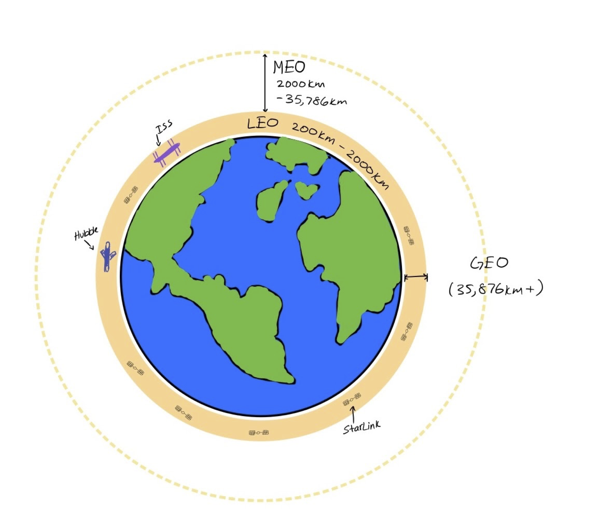
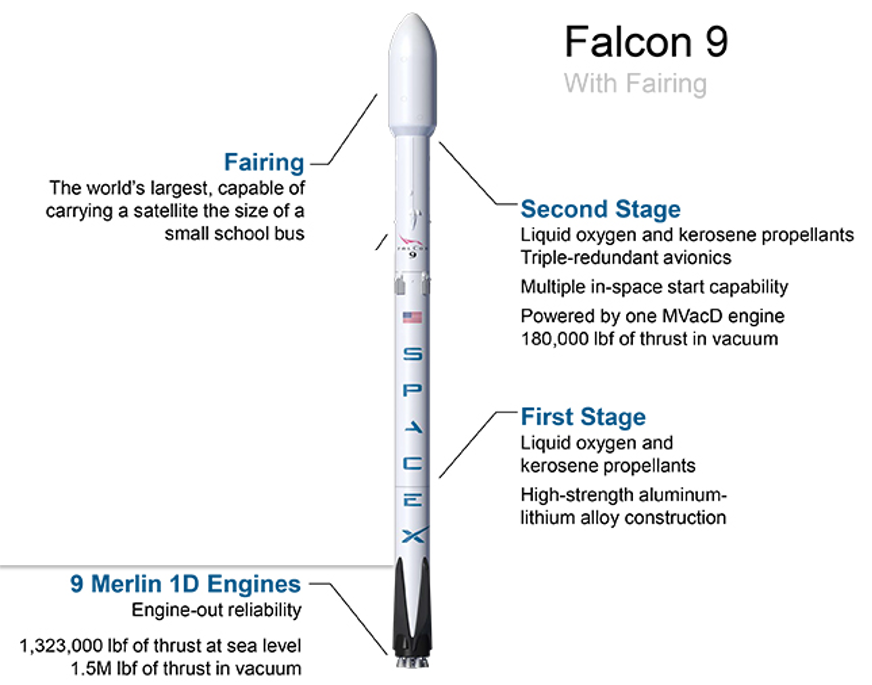


Authors: [Ravi Chamarti](https://www.linkedin.com/in/ravi-chamarti-804538/), [Naren Byrapuram](https://www.linkedin.com/in/narendra-byrapuram-823535/), [Kishore Chitrapu](https://www.linkedin.com/in/kishorechitrapu/)

## Abstract

In 2020, the COVID-19 pandemic escalated the urgency for internet access everywhere and everyone, especially in rural areas. COVID-19 lockdowns are temporary, but the under-connected population will have a lasting impact. Low-Earth Orbit (LEO) communication satellites recently pioneered by SpaceX's Starlink demonstrated is achievabile.

With rapid breakthroughs in rocket launchers, satellites, small chips, favorable sentiments, and high investments, the LEO small satellite constellations offer a near constant low (30ms) latency is across is attainable. Low latency global internet automated driving, data centers, supply chains including freight, agriculture, and other prominent industries. This paper discusses the advantages of LEO nanosat technology feasibility, challenges ahead, and issues in the offing.

## Introduction
Ever since the satellite launch kickoff on Oct 4, 1957, space technology never stopped. By 12/31/2021, there will be 3,372 (Union of Concerned Scientists) orbiting around Earth. A burst of talent and funding in the last decade has increased low orbit constellations. Private funded space exploration, the rise of data use, nanotechnology,  robotics, and social media have created a concourse to LEO satellites. We here examine Low-Earth Orbit (LEO) small satellite technology, applications, and challenges in this paper. A sequel of this paper will give an in-depth analysis of technology, business, and ethical challenges.

## Orbits and Satellites
Satellite technology has been extensively used in telecommunications, observation, and remote sensing. The primary factor in satellite technology is orbital distance. Satellite orbit determines
satellite size, satellite speed, radiofrequency, and satellite count. For communication purposes, there are mainly two low orbits for satellites:

### Geostationary orbit (GEO)
About sixteen percent of the current satellite population is parked in GEO. As shown in the above figure, the orbit is aligned with the equator and is 35,786km above sea level with orientation aligned with Earth’s rotation. The satellite orbital speed is aligned with Earth. It serves communication systems and Global Positioning Systems (GPS).  The satellites launched into this orbit have the highest failure rate. GEO satellite life expectancy is from seven to fifteen years (Northern Sky Research). About seventy percent of the satellites in this orbit have come to EOL but still are expected to be prolonged due to advanced operational efficiencies.

#### Problems with satellites in GEO
The long-distance ( > 35,000km) incurs unavoidable travel times, delivering high latency (400ms) and low bandwidth (50-100Mbps). Strong satellite signal strength has to be high to survive during travel. GEO delivers a wide coverage area. Lesser times to orbit around Earth. Fewer ground stations and concentrated equipment. The frequency spectrum is liberally spaced among competitors. As GEO satellites orbit concentric to the equator, most countries in the northern hemisphere and southern hemisphere in higher altitudes suffer interference due to dish angle pointing at the satellite. 
Above sixty percent of GEO have aged beyond the expected lifespan. GEO satellite companies are faced with a decision to replace or exhaust out these satellites. Some companies interested in continuance are replacing GEO with LEO satellites.

## Low Earth Orbit
Low-Earth Orbit objects revolve 160-2,000km from sea level. Most of the man-made objects revolve in this region. The International space station (ISS) and Hubble telescope are two notable satellites orbiting in this region.

Small form factor electronic devices, long-lasting batteries, efficient solar panels, and rocket launchers to deliver satellites are some of the recent advancements in space technology that exploded the growth in satellites launched into this orbit. The LEO satellites have been shrinking in size while simultaneously lower launching costs. In the new millennium, SpaceX, TeleSat, and Amazon Kuiper have been in news with plans to launch thousands of satellites to form artificial constellations in space. With abundant funds, these companies aim to tackle the ubiquitous Internet problem along with confidential long-term overarching business goals. The companies plan to launch thousands of “small satellites” into numerous orbital planes to form a satellite constellation. Satellites further smaller in size namely micro and nanosatellites are pursued mostly by smaller players.

In this paper, we discuss small satellite constellations in LEO.  

## Small satellites constellations 
The small satellite launch technology attained an unprecedented level of precision and cost efficiency in the last decade.  SpaceX Starlink, Amazon Kuiper tied to Blue Origins are two amply funded companies launching satellites. While both remain in early stages and secretive about the plans, netizens have widely gleaned SpaceX Starlink information. As of March 2021, Starlink has already launched 1,023 in 18 launches and is aiming to deploy a total of 1,440 to complete the initial constellation. According to the FCC filings, Starlink applied for 42,000 satellites to orbit in LEO to provide Internet service. Most of the information we present here is based on SpaceX Starlink small satellites information on the Internet. In addition to delivering communication, small satellites provide monitoring Earth and enhance space observation.
## Small satellite
Small satellites in the short form are smallsats. A Starlink smallsat weighs around 227kg to 260kg. It orbits in LEO with a lifespan of three to four years. While there are tens of components, a small satellite typically has these key components: Two redundant solar flat panels to power the satellite Thrusters for position adjustment in the orbit High-power phased array antennas for ground communication over Ku and Ka bands Optical inter-satellite links The phased array antennas shoot narrow beams to 27,000 kmph orbiting Earth. The satellites' orbits at 400km - 2000km above sea level.

## Constellation

Constellations are identical small satellites orbiting Earth in multiple planes. The smallsats are managed at scale bringing economies of scale for the owning enterprise. 

## The lifecycle of small satellites

### Launch
The liftoff to the deployment of Starlink smallsats on the SpaceX Falcon9 rocket completes in 65 minutes. Satellite launch transformed from a magical event to a routine deployment. SpaceX slashed launch costs at least ten times (projected to be 1000x) employing breakthroughs especially with the reuse of engines and fairings. A launch is estimated to cost $30 million. The 70m tall Falcon9 launches in two stages:

_Source: https://asd.gsfc.nasa.gov/archive/tess/launch.html_
#### Stage1 
The 60 Starlink smallsats are stacked as payload in the rocker. Smallsats are powered down and assorted in the top one-third fairing of the rocket in the above picture. The bottom two-third is the booster engine with a mission to carry the payload to 65 km altitude. On completing a successful stage 1 launch, the booster returns to Earth for reuse. SpaceX’s reusable launch system technology for the first booster stage saves all nine engines. The boosters are reused up to nine times (SpaceX #). After taking additional fuel, refurbishment (10%), and payload reduction (under 40%) into consideration, SpaceX brings rocket launch cost down to $30 million. The rocket payload approximately costs $1,350/kg. For comparison, international shipping rates are approximately $15/kg. See Appendix A for launch costs. This stage completes with the main engine cutoff in about two and half minutes. The booster returns to Earth with main engines while Stage 2 heads to orbit.

#### Stage 2
The Stage 2 head is clamshell-like “fairing” to protect smallsats from launch time excessive heat and pressure. The fairing shell peels down to Earth at the beginning of this stage. The lone engine carries the payload to orbit. At this, the Stage 2 engine takes 35 minutes to get to orbit and park Starlink satellites. About 64 minutes after launch, the rocket deploys smallsats into their orbits.

### Constellation formation
The orbiting smallsats take 2 weeks to distance themselves and take a position. Each smallsat is configured to occupy a position using: Orbit’s height from sea level, the angle from the equator, and angle from a fixed space direction Smallsat’s angle from a fixed space direction The smallsats are launched initially into a lower orbit. As orbital velocity decreases with altitude, the smallsat changes velocity to match with the target orbital plane. On arriving into the position, the smallsat will lock velocity. As the count of satellites locked into position increases, the constellation size increases. The constellation formation model is nicely depicted in 

### Functional phase
Once in orbit, a smallsat is a member of the constellation in routing packets from the terrestrial network. The smallsat forward packets amongst themselves for reliability and continuity of the network.
Packets flow from the edge device to the Spacelink user terminal, which is a pizza-sized dish antenna. Packets are encrypted at the user terminal before beaming to the smallsat. The first smallsat will inspect the destination address to route to a smallsat positioned in the same direction as the packet. The last satellite closer to the destination coordinates will beam the packet down to all user terminals in its coverage. Only the user terminal will have a decryption key to read the packet.



### Termination
After 5 years of runtime satellite parts erode due to cosmic rays. Need to be decommissioned. The satellite is maneuvered out of the orbit and is ready to self-burn

## Applications

A wide variety of applications are possible for smallsat internet. A few are:
1. End-to-end secure cloud services. Datacenters/Kuiper
2. Autonomous vehicles/Starlink
3. Mobility market includes backhaul for 5G in COW autonomous vehicles
4. Government or military
5. Underserved rural areas (Rural Digital Opportunity Fund)
6. Asset tracking on aircraft, ship, logistics, fleet management

## Summary
We are confident LEO small satellite technology can provide ubiquitous internet. The path is curvy ahead. LEOstat is breaking the barriers of traditional satellite communication. It has the potential to better level the field for 7 billion people around the globe. The LEOsats will play a key role in inter-data center encrypted private channels, supply chain automation, mobility automation, and natural vegetation. Is this the next big thing?

## References
1. [A Basic Guide to small satellites](https://www.satelliteevolutiongroup.com/articles/leosat-April17.pdf)
2. [NSR Insight: A Critical Assessment Of HTS Satellite Constellations – SatNews](http://clarkeinstitute.org/wp-content/uploads/2010/04/ClarkeWirelessWorldArticle.pdf)
4. [Large LEO satellite constellations: Will it be different this time?](https://ieeexplore.ieee.org/stamp/stamp.jsp?tp=&arnumber=9051712)
5.  [Starlink satellites - N2YO](https://www.n2yo.com/satellites/?c=52)
6.  [Launch and deployment of distributed small satellite systems - ScienceDirect](https://www.sciencedirect.com/science/article/pii/S009457651500171X)
7. [From Connectivity to Advanced Internet Services: A Comprehensive Review of Small Satellites Communications and Networks](https://www.hindawi.com/journals/wcmc/2019/6243505/)
8. [Northern Sky Research. “Satellite EOL: No one size fits all.”](https://www.nsr.com/satellite-eol-not-one-size-fits-all/)
9. [“SpaceX releases new details on Starlink satellite design.” SpaceX releases new details on Starlink satellite design](https://spaceflightnow.com/2019/05/15/spacex-releases-new-details-on-starlink-satellite-design/)
10. [Starlink Satellites](https://space.skyrocket.de/doc_sdat/starlink-v1-0.htm)
11. [Union of Concerned Scientists. “UCS Satellite Database.”](https://www.ucsusa.org/resources/satellite-database#.W7WcwpMza9Y.)
12. [Starlink packet routing](https://caseyhandmer.wordpress.com/2020/09/23/starlink-packet-routing/)
 
Om shanti shanti shanti
 

## Appendix

### Orbits and their altitudes

| Orbital Altitude | Space band  |
| ------------- |:-------------:| 
|    >15,000 km  | upper van allen belt |
| 5000 - 15,000 km      | MEO|
| 2000 - 5000 km | lower van allen belt |
| 200 - 2000 km | LEO |
| 10 km | international flights|

### Internet provide launch costs

Comparison of internet service providers 

| Parameter | Fiber  | GEO | 5G | LEO |
| ------------- |:-------------:| :-------------:| :-------------:| :-------------:| 
| Speed  | 5Gbps (leased) | 5-100Mpbps | 1-2Gbps | 1-5 Gbps |
| Latency  |  | 400ms |  | 25ms |
| Cost  |  | proportional to distance | Launching costss | Tower setup, repeater count | Launching costs, operational costs |
| Variations | Terrain | Weather | Line of sight | Weather |

